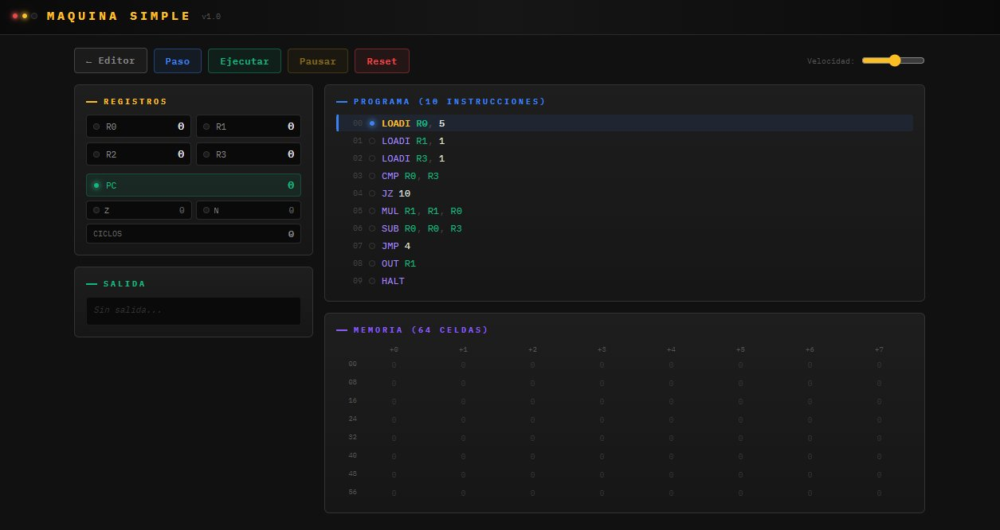
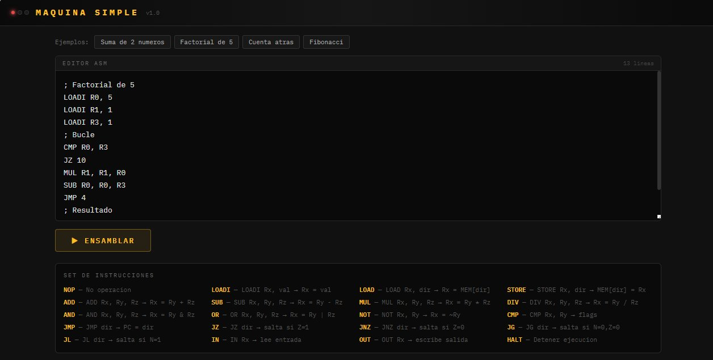
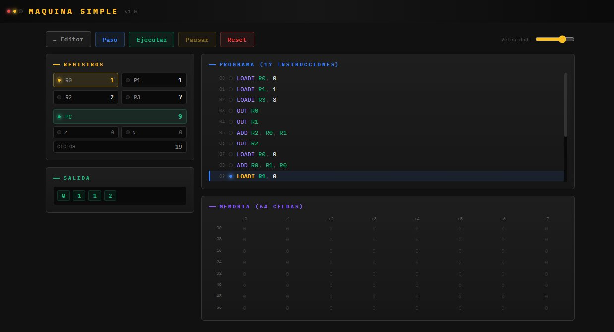

# 🖥️ Simulador Interactivo de Máquina Simple

<div align="center">


**Simulador interactivo de una CPU simplificada con ensamblador integrado, ejecución paso a paso y visualización en tiempo real de registros, memoria y flags.**

[🚀 Demo en vivo](https://ebalvis.github.io/Simulador-interactivo-de-maquina-simple/) · [📖 Manual de uso](#manual-de-uso) · [⚙️ Set de instrucciones](#set-de-instrucciones) · [📝 Ejemplos](#programas-de-ejemplo)



</div>

---

## 📋 Tabla de contenidos

- [Descripción](#descripción)
- [Características](#características)
- [Capturas de pantalla](#capturas-de-pantalla)
- [Demo en vivo](#demo-en-vivo)
- [Instalación local](#instalación-local)
- [Manual de uso](#manual-de-uso)
- [Arquitectura de la máquina](#arquitectura-de-la-máquina)
- [Set de instrucciones](#set-de-instrucciones)
- [Programas de ejemplo](#programas-de-ejemplo)
- [Estructura del proyecto](#estructura-del-proyecto)
- [Desarrollo](#desarrollo)
- [Contribuir](#contribuir)
- [Licencia](#licencia)

---

## Descripción

Este proyecto implementa un **simulador de máquina simple** orientado a la enseñanza de los fundamentos de la arquitectura de computadores. Permite escribir programas en lenguaje ensamblador, ensamblarlos y ejecutarlos paso a paso, observando en tiempo real cómo cambian los registros, la memoria, los flags y el contador de programa.

Está diseñado como herramienta educativa para cursos de:

- Arquitectura de Computadores
- Sistemas Digitales
- Fundamentos de Programación a Bajo Nivel
- Organización de Computadores

## Características

- **Editor de ensamblador** con detección de errores en tiempo de ensamblado
- **Ejecución paso a paso** (Step) o continua (Run) con velocidad ajustable
- **4 registros de propósito general** (R0–R3) con indicador visual LED de modificación
- **64 celdas de memoria** con resaltado de accesos en tiempo real
- **Flags de estado**: Zero (Z) y Negativo (N) con indicadores luminosos
- **Contador de programa** (PC) y contador de ciclos
- **20 instrucciones** que cubren aritmética, lógica, comparación, saltos y E/S
- **4 programas de ejemplo** precargados para aprendizaje inmediato
- **Interfaz retro-industrial** con LEDs indicadores y estética de terminal
- **100% cliente** — sin servidor, sin dependencias, funciona offline
- **Responsivo** — se adapta a pantallas de escritorio y móvil

## Capturas de pantalla

### Editor de ensamblador
Editor integrado con selector de programas de ejemplo y referencia completa del set de instrucciones.



### Vista de ejecución — Factorial
Ejecución paso a paso del programa Factorial de 5. Se observa el resaltado azul de la instrucción actual (PC=0), los registros inicializados a cero y el panel de programa con las 10 instrucciones ensambladas.


### Vista de ejecución — Fibonacci
Ejecución del programa Fibonacci tras 19 ciclos. Los registros muestran los valores intermedios (R0=1, R1=1, R2=2, R3=7), la salida muestra la secuencia parcial `0, 1, 1, 2` y el PC apunta a la instrucción 9.



## Demo en vivo

👉 **[https://ebalvis.github.io/Simulador-interactivo-de-maquina-simple/](https://ebalvis.github.io/Simulador-interactivo-de-maquina-simple/)**

No requiere instalación. Funciona directamente en cualquier navegador moderno.

## Instalación local

### Clonar el repositorio

```bash
git clone https://github.com/ebalvis/Simulador-interactivo-de-maquina-simple.git
cd Simulador-interactivo-de-maquina-simple
```

### Ejecutar

```bash
# Opción 1: Abrir directamente en el navegador
open index.html          # macOS
xdg-open index.html      # Linux
start index.html         # Windows

# Opción 2: Servidor local (opcional, para desarrollo)
python3 -m http.server 8080
# Luego visitar http://localhost:8080
```

> **Nota**: No se requiere Node.js, npm ni ninguna herramienta de build. El proyecto funciona directamente en el navegador.

## Manual de uso

### 1. Escribir código

En la pantalla del **Editor ASM**, escribe tu programa en ensamblador o selecciona uno de los ejemplos precargados (Suma, Factorial, Cuenta atrás, Fibonacci).

```asm
; Los comentarios empiezan con punto y coma
LOADI R0, 10      ; Cargar valor inmediato 10 en R0
LOADI R1, 20      ; Cargar valor inmediato 20 en R1
ADD R2, R0, R1    ; R2 = R0 + R1
OUT R2            ; Mostrar resultado
HALT              ; Detener ejecución
```

### 2. Ensamblar

Pulsa el botón **▶ ENSAMBLAR**. Si hay errores de sintaxis, se mostrarán debajo del editor con el número de línea correspondiente.

### 3. Ejecutar

Una vez ensamblado, se muestra la vista de ejecución con los siguientes controles:

| Botón | Función |
|-------|---------|
| **← Editor** | Volver al editor de código |
| **Paso** | Ejecutar una sola instrucción |
| **Ejecutar** | Ejecutar continuamente |
| **Pausar** | Pausar la ejecución continua |
| **Reset** | Reiniciar la CPU al estado inicial |
| **Velocidad** | Slider para ajustar la velocidad de ejecución |

### 4. Observar

Durante la ejecución puedes observar en tiempo real:

- **Registros**: Los valores de R0–R3, con LED amarillo y resaltado cuando se modifican
- **PC**: El contador de programa indica la siguiente instrucción a ejecutar
- **Flags Z y N**: Los LEDs se iluminan (azul y rojo) cuando están activos
- **Programa**: La instrucción actual se resalta en azul con indicador lateral
- **Memoria**: Las celdas accedidas se resaltan en púrpura
- **Salida**: Los valores emitidos con `OUT` aparecen como chips verdes en el panel de salida
- **Ciclos**: Contador de instrucciones ejecutadas

## Arquitectura de la máquina

### Especificaciones

| Componente | Especificación |
|------------|---------------|
| Registros de propósito general | 4 (R0, R1, R2, R3) |
| Tamaño de palabra | Entero con signo (JavaScript Number) |
| Memoria | 64 celdas direccionables (0x00–0x3F) |
| Contador de programa (PC) | 0 – 63 |
| Flags | Z (Zero), N (Negativo) |
| Entrada/Salida | Cola de entrada, buffer de salida |

### Diagrama de bloques

```
┌─────────────────────────────────────────────┐
│                    CPU                       │
│                                             │
│  ┌──────────┐  ┌──────────┐  ┌───────────┐ │
│  │ Registros│  │  ALU     │  │  Unidad   │ │
│  │ R0..R3   │──│ +−×÷&|~ │──│  Control  │ │
│  └──────────┘  └──────────┘  └─────┬─────┘ │
│       │              │             │        │
│  ┌────┴──────────────┴─────────────┴──┐     │
│  │              Bus interno            │     │
│  └────┬──────────────┬────────────┬───┘     │
│       │              │            │         │
│  ┌────┴────┐   ┌─────┴────┐ ┌────┴────┐    │
│  │   PC    │   │  Flags   │ │  E/S    │    │
│  │ 0..63   │   │  Z  | N  │ │ IN/OUT  │    │
│  └─────────┘   └──────────┘ └─────────┘    │
└──────────────────────┬──────────────────────┘
                       │
              ┌────────┴────────┐
              │   Memoria       │
              │   64 celdas     │
              │   [0x00..0x3F]  │
              └─────────────────┘
```

### Ciclo de ejecución

Cada instrucción sigue el ciclo clásico:

1. **Fetch** — Leer instrucción en `programa[PC]`
2. **Decode** — Decodificar opcode y operandos
3. **Execute** — Ejecutar la operación en la ALU
4. **Writeback** — Almacenar resultado en registro/memoria
5. **Update PC** — Incrementar PC o aplicar salto

## Set de instrucciones

### Transferencia de datos

| Instrucción | Formato | Descripción |
|-------------|---------|-------------|
| `LOADI` | `LOADI Rx, valor` | Carga un valor inmediato en Rx |
| `LOAD` | `LOAD Rx, dir` | Carga el contenido de MEM[dir] en Rx |
| `STORE` | `STORE Rx, dir` | Almacena el valor de Rx en MEM[dir] |

### Aritmética

| Instrucción | Formato | Descripción |
|-------------|---------|-------------|
| `ADD` | `ADD Rx, Ry, Rz` | Rx = Ry + Rz |
| `SUB` | `SUB Rx, Ry, Rz` | Rx = Ry − Rz |
| `MUL` | `MUL Rx, Ry, Rz` | Rx = Ry × Rz |
| `DIV` | `DIV Rx, Ry, Rz` | Rx = Ry ÷ Rz (división entera, Rz=0 → 0) |

### Lógica

| Instrucción | Formato | Descripción |
|-------------|---------|-------------|
| `AND` | `AND Rx, Ry, Rz` | Rx = Ry AND Rz (bit a bit) |
| `OR` | `OR Rx, Ry, Rz` | Rx = Ry OR Rz (bit a bit) |
| `NOT` | `NOT Rx, Ry` | Rx = NOT Ry (complemento a 1) |

### Comparación

| Instrucción | Formato | Descripción |
|-------------|---------|-------------|
| `CMP` | `CMP Rx, Ry` | Compara Rx con Ry. Establece Z=1 si iguales, N=1 si Rx < Ry |

### Saltos

| Instrucción | Formato | Descripción |
|-------------|---------|-------------|
| `JMP` | `JMP dir` | Salto incondicional a la dirección dir |
| `JZ` | `JZ dir` | Salta si Z=1 (iguales tras CMP) |
| `JNZ` | `JNZ dir` | Salta si Z=0 (distintos tras CMP) |
| `JG` | `JG dir` | Salta si N=0 y Z=0 (mayor que) |
| `JL` | `JL dir` | Salta si N=1 (menor que) |

> **Importante**: Las direcciones de salto se refieren al **número de instrucción** (base 0), no al número de línea del código fuente. Los comentarios y líneas vacías no cuentan como instrucciones.

### Control y E/S

| Instrucción | Formato | Descripción |
|-------------|---------|-------------|
| `NOP` | `NOP` | No hace nada (avanza PC) |
| `IN` | `IN Rx` | Lee un valor de la cola de entrada en Rx |
| `OUT` | `OUT Rx` | Escribe el valor de Rx en la salida |
| `HALT` | `HALT` | Detiene la ejecución |

### Sintaxis del ensamblador

- Los **comentarios** comienzan con `;` y se extienden hasta el final de la línea
- Las instrucciones son **insensibles a mayúsculas/minúsculas** (`add` = `ADD` = `Add`)
- Los registros se escriben como `R0`, `R1`, `R2`, `R3`
- Los operandos se separan con **comas y/o espacios**
- Las **líneas en blanco** y líneas de solo comentario se ignoran

## Programas de ejemplo

### Suma de dos números

```asm
; Suma de dos numeros
LOADI R0, 5        ; Primer operando
LOADI R1, 3        ; Segundo operando
ADD R2, R0, R1     ; R2 = 5 + 3
OUT R2             ; Salida: 8
HALT
```

### Factorial de 5

```asm
; Calcula 5! = 120
LOADI R0, 5        ; n = 5
LOADI R1, 1        ; resultado = 1
LOADI R3, 1        ; constante para decrementar
; Bucle (instrucción 4)
CMP R0, R3         ; ¿n == 1?
JZ 10              ; Si sí, ir a resultado
MUL R1, R1, R0     ; resultado *= n
SUB R0, R0, R3     ; n--
JMP 4              ; Volver al inicio del bucle
; Resultado (instrucción 10)
OUT R1             ; Salida: 120
HALT
```

### Cuenta atrás

```asm
; Cuenta atrás desde 10 hasta 0
LOADI R0, 10       ; Contador = 10
LOADI R1, 1        ; Decremento
LOADI R2, 0        ; Límite
; Bucle (instrucción 4)
OUT R0             ; Mostrar contador
CMP R0, R2         ; ¿Contador == 0?
JZ 10              ; Si sí, fin
SUB R0, R0, R1     ; Contador--
JMP 4              ; Repetir
; Fin (instrucción 10)
HALT
```

### Serie de Fibonacci

```asm
; Genera los primeros términos de Fibonacci
; Salida: 0, 1, 1, 2, 3, 5, 8, 13, 21, 34
LOADI R0, 0        ; a = 0
LOADI R1, 1        ; b = 1
LOADI R3, 8        ; Contador de iteraciones
OUT R0             ; Mostrar a
OUT R1             ; Mostrar b
; Bucle (instrucción 6)
ADD R2, R0, R1     ; c = a + b
OUT R2             ; Mostrar c
LOADI R0, 0
ADD R0, R1, R0     ; a = b
LOADI R1, 0
ADD R1, R2, R1     ; b = c
LOADI R2, 1
SUB R3, R3, R2     ; Contador--
LOADI R2, 2
CMP R3, R2         ; ¿Contador == 2?
JNZ 6              ; Si no, repetir
HALT
```

> Más ejemplos disponibles en la carpeta [`examples/`](examples/).

## Estructura del proyecto

```
Simulador-interactivo-de-maquina-simple/
├── index.html                 # Punto de entrada principal
├── src/
│   ├── css/
│   │   └── styles.css         # Estilos de la interfaz
│   └── js/
│       ├── cpu.js             # Núcleo de la CPU (registros, ALU, ejecución)
│       ├── assembler.js       # Ensamblador (parser, tokenizer, ejemplos)
│       ├── ui.js              # Renderizado de la interfaz
│       └── app.js             # Estado global y controladores
├── examples/
│   ├── 01-suma.asm            # Suma de dos números
│   ├── 02-factorial.asm       # Factorial de 5
│   ├── 03-cuenta-atras.asm    # Cuenta atrás
│   ├── 04-fibonacci.asm       # Serie de Fibonacci
│   ├── 05-maximo.asm          # Máximo de dos números
│   └── 06-memoria.asm         # Uso de LOAD/STORE
├── docs/
│   ├── ARCHITECTURE.md        # Documentación de la arquitectura
│   ├── ISA.md                 # Referencia completa del ISA
│   └── TUTORIAL.md            # Tutorial paso a paso para principiantes
├── assets/
│   ├── screenshot-editor.png
│   ├── screenshot-ejecucion.png
│   └── screenshot-fibonacci.png
├── .github/
│   ├── ISSUE_TEMPLATE/
│   │   ├── bug_report.md
│   │   └── feature_request.md
│   └── workflows/
│       └── deploy.yml         # Deploy automático a GitHub Pages
├── .gitignore
├── CONTRIBUTING.md
├── CHANGELOG.md
├── LICENSE
└── README.md
```

## Desarrollo

### Arquitectura del código

El proyecto sigue una separación clara de responsabilidades:

| Módulo | Archivo | Responsabilidad |
|--------|---------|----------------|
| **CPU** | `src/js/cpu.js` | Modelo de la CPU: registros, memoria, flags, ejecución de instrucciones |
| **Assembler** | `src/js/assembler.js` | Parsing del código fuente, tokenización, generación de programa |
| **UI** | `src/js/ui.js` | Renderizado HTML de todos los paneles y componentes |
| **App** | `src/js/app.js` | Estado global, controladores de eventos, bucle de ejecución |

### Tecnologías

- **JavaScript ES5** — máxima compatibilidad, sin transpilador
- **CSS3** con variables, grid y animaciones
- **HTML5** semántico
- **Google Fonts** — IBM Plex Mono (fallback a Courier New)
- **Sin dependencias externas** — zero build, zero install

### Añadir nuevas instrucciones

1. Añadir el opcode en `OPCODES` dentro de `cpu.js`
2. Añadir la entrada en `INSTRUCTION_INFO`
3. Implementar el `case` en `stepCPU()`
4. Añadir el parsing en `assemble()` dentro de `assembler.js`
5. Actualizar la documentación en `docs/ISA.md`

## Contribuir

¡Las contribuciones son bienvenidas! Consulta [CONTRIBUTING.md](CONTRIBUTING.md) para más detalles.

Algunas ideas de mejoras:

- [ ] Soporte para etiquetas (labels) en el ensamblador
- [ ] Instrucciones de pila (PUSH/POP)
- [ ] Subrutinas (CALL/RET)
- [ ] Más registros configurables
- [ ] Exportar/importar programas como archivos `.asm`
- [ ] Breakpoints en la vista de ejecución
- [ ] Modo oscuro/claro
- [ ] Internacionalización (i18n)
- [ ] Tests unitarios

## Licencia

Este proyecto está bajo la licencia [MIT](LICENSE). Puedes usarlo libremente en contextos educativos y comerciales.

---

<div align="center">

Hecho con ⚡ para la enseñanza de Arquitectura de Computadores

[🚀 Ver demo en vivo](https://ebalvis.github.io/Simulador-interactivo-de-maquina-simple/)

</div>
